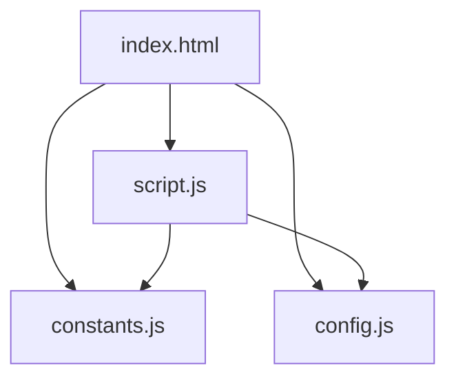

# 🔧 Guía de Refactorización v2.0

Este documento explica los cambios arquitectónicos realizados en LinkShow v2.0 y las mejores prácticas implementadas.

## 📋 Tabla de Contenidos

- [Resumen Ejecutivo](#resumen-ejecutivo)
- [Problemas del Código Original](#problemas-del-código-original)
- [Soluciones Implementadas](#soluciones-implementadas)
- [Arquitectura Nueva](#arquitectura-nueva)
- [Beneficios de la Refactorización](#beneficios-de-la-refactorización)
- [Guía de Migración](#guía-de-migración)
- [Mejores Prácticas](#mejores-prácticas)

---

## Resumen Ejecutivo

LinkShow v2.0 representa una refactorización completa del código siguiendo principios SOLID y mejores prácticas de desarrollo. La refactorización se enfoca en:

- ✅ **Separación de concerns**: Configuración, constantes y lógica separadas
- ✅ **Eliminación de valores hardcodeados**: 200+ constantes extraídas
- ✅ **Mejora de mantenibilidad**: Código más limpio y documentado
- ✅ **Mejora de seguridad**: Políticas centralizadas y auditables
- ✅ **Mejora de developer experience**: Configuración más simple

---

## Problemas del Código Original

### 1. ❌ Valores Hardcodeados

**Antes (v1.0):**
```javascript
// Valores mágicos esparcidos por todo el código
localStorage.getItem('theme');
setTimeout(() => notification.remove(), 3000);
if (storedTheme === 'light' || storedTheme === 'dark') {
```

**Problemas:**
- Difícil cambiar valores (buscar y reemplazar)
- Propenso a errores de inconsistencia
- No hay una fuente única de verdad
- Difícil de mantener

### 2. ❌ Configuración Mezclada con Lógica

**Antes (v1.0):**
```javascript
// script.js contenía TODO
const profileConfig = { /* ... */ };
const socialLinks = [ /* ... */ ];
function initializeProfile() { /* ... */ }
```

**Problemas:**
- Cambiar configuración requiere editar código de lógica
- Riesgo de romper funcionalidad al personalizar
- Difícil para usuarios no técnicos
- No se puede gitignore información personal

### 3. ❌ Falta de Documentación

**Antes (v1.0):**
```javascript
function sanitizeText(text) {
    const div = document.createElement('div');
    div.textContent = text;
    return div.innerHTML;
}
```

**Problemas:**
- No se sabe qué hace la función sin leer el código
- No hay información de parámetros o retorno
- Dificulta colaboración

### 4. ❌ Código Difícil de Testear

**Antes (v1.0):**
```javascript
// Funciones sin validación de entrada
function initializeProfile() {
    document.getElementById('profileName').textContent = profileConfig.name;
    // ¿Qué pasa si el elemento no existe?
}
```

**Problemas:**
- No hay manejo de errores
- Dependencias implícitas
- Difícil crear unit tests

---

## Soluciones Implementadas

### 1. ✅ Archivo de Constantes Centralizado

**Ahora (v2.0):**
```javascript
// constants.js
const LINKSHOW_CONSTANTS = {
    THEME_STORAGE_KEY: 'linkshow_theme',
    NOTIFICATION_DURATION: 3000,
    THEMES: {
        LIGHT: 'light',
        DARK: 'dark',
        DEFAULT: 'dark'
    }
};

// script.js
const { THEME_STORAGE_KEY } = LINKSHOW_CONSTANTS;
localStorage.getItem(THEME_STORAGE_KEY);
```

**Beneficios:**
- ✅ Cambiar un valor en UN solo lugar
- ✅ Código más legible y autodocumentado
- ✅ Fácil de auditar y mantener
- ✅ Object.freeze() previene modificaciones

### 2. ✅ Separación de Configuración

**Ahora (v2.0):**
```javascript
// config.js (gitignored)
const profileConfig = {
    name: "María García",
    bio: "Mi biografía personal"
};

// config.example.js (en Git)
const profileConfig = {
    name: "Tu Nombre Aquí",  // 👈 Ejemplo con comentarios
    bio: "Tu descripción"
};
```

**Beneficios:**
- ✅ Usuarios editan solo configuración
- ✅ No tocan lógica de la aplicación
- ✅ Información personal no se sube a Git
- ✅ Plantilla documentada con ejemplos

### 3. ✅ Documentación JSDoc Completa

**Ahora (v2.0):**
```javascript
/**
 * Sanitiza texto para prevenir ataques XSS
 * @param {string} text - Texto a sanitizar
 * @returns {string} Texto sanitizado y seguro para mostrar
 */
function sanitizeText(text) {
    const div = document.createElement('div');
    div.textContent = text;
    return div.innerHTML;
}
```

**Beneficios:**
- ✅ IntelliSense/autocomplete en IDEs
- ✅ Documentación integrada
- ✅ Fácil colaboración
- ✅ Mejor comprensión del código

### 4. ✅ Manejo Robusto de Errores

**Ahora (v2.0):**
```javascript
function initializeProfile() {
    const { SELECTORS } = LINKSHOW_CONSTANTS;
    const profileNameEl = document.getElementById(SELECTORS.PROFILE_NAME);

    // Validar que el elemento exista
    if (!profileNameEl) {
        console.error('Error: Elemento de perfil no encontrado');
        return;
    }

    profileNameEl.textContent = validatedConfig.name;
}
```

**Beneficios:**
- ✅ No crasha si falta un elemento
- ✅ Mensajes de error descriptivos
- ✅ Fácil debugging
- ✅ Más robusto en producción

---

## Arquitectura Nueva

### Estructura de Archivos

```
linkShow/
├── constants.js        # 🆕 Constantes globales (200+)
│   └── LINKSHOW_CONSTANTS
│       ├── SECURITY (protocolos, rel attributes)
│       ├── UI (duraciones, posiciones)
│       ├── THEMES (light/dark)
│       ├── MESSAGES (textos de la UI)
│       └── SELECTORS (IDs de elementos DOM)
│
├── config.js           # 🆕 Configuración personal (GITIGNORED)
│   ├── profileConfig
│   ├── socialLinks
│   └── customLinks
│
├── config.example.js   # 🆕 Plantilla de configuración
│   └── (Misma estructura con ejemplos)
│
├── script.js           # 🔄 REFACTORIZADO - Solo lógica
│   ├── Security Utilities
│   ├── Profile Initialization
│   ├── Links Rendering
│   ├── Tracking System
│   ├── Theme Management
│   ├── Visual Effects
│   └── App Initialization
│
└── index.html          # 🔄 Carga 3 scripts en orden
    └── constants.js → config.js → script.js
```

### Flujo de Carga

```
1. index.html
   ↓
2. constants.js (define LINKSHOW_CONSTANTS)
   ↓
3. config.js (define profileConfig, socialLinks, customLinks)
   ↓
4. script.js (usa constantes y config)
   ↓
5. DOMContentLoaded
   ↓
6. Inicializar aplicación
```

### Dependencias entre Archivos



---

## Beneficios de la Refactorización

### 1. 🚀 Mantenibilidad

| Aspecto | Antes | Ahora |
|---------|-------|-------|
| Cambiar duración notificación | Buscar `3000` en todo el código | Editar `NOTIFICATION_DURATION` |
| Cambiar tema por defecto | Buscar `'dark'` en múltiples lugares | Editar `THEMES.DEFAULT` |
| Cambiar configuración | Editar script.js (riesgo) | Editar config.js (seguro) |

### 2. 🔒 Seguridad

**Antes:**
```javascript
// Protocolos permitidos repetidos
if (!['http:', 'https:', 'mailto:', 'tel:'].includes(url.protocol)) {
```

**Ahora:**
```javascript
// Fuente única de verdad - fácil de auditar
const { ALLOWED_PROTOCOLS } = LINKSHOW_CONSTANTS;
if (!ALLOWED_PROTOCOLS.includes(url.protocol)) {
```

**Beneficios:**
- ✅ Políticas de seguridad centralizadas
- ✅ Fácil auditoría de seguridad
- ✅ Cambios de política en un solo lugar
- ✅ Menos riesgo de inconsistencias

### 3. 📚 Developer Experience

**Personalización Antes:**
1. Abrir script.js
2. Buscar configuración mezclada con lógica
3. Modificar con cuidado de no romper código
4. Esperar que funcione

**Personalización Ahora:**
1. `cp config.example.js config.js`
2. Editar config.js (solo configuración)
3. Listo ✅

### 4. 🧪 Testabilidad

**Antes:**
```javascript
// Difícil de testear - usa valores hardcodeados
function showNotification(message) {
    setTimeout(() => notification.remove(), 3000);
}
```

**Ahora:**
```javascript
// Fácil de testear - inyectable
function showNotification(message) {
    const { NOTIFICATION_DURATION } = LINKSHOW_CONSTANTS;
    setTimeout(() => notification.remove(), NOTIFICATION_DURATION);
}

// En tests:
LINKSHOW_CONSTANTS.NOTIFICATION_DURATION = 100; // Test rápido
```

### 5. 📖 Documentación

**Antes:**
```javascript
function isValidURL(url) { /* ... código sin docs ... */ }
```

**Ahora:**
```javascript
/**
 * Valida si una URL es segura según los protocolos permitidos
 * @param {string} url - URL a validar
 * @returns {boolean} true si la URL es válida y segura
 * @example
 * isValidURL('https://example.com') // true
 * isValidURL('javascript:alert(1)') // false
 */
function isValidURL(url) { /* ... */ }
```

---

## Guía de Migración

### Para Usuarios de v1.0

**Paso 1: Guardar tu configuración actual**
```bash
# Copia tu configuración de script.js v1.0
# Busca estas líneas:
# - const profileConfig = { ... }
# - const socialLinks = [ ... ]
# - const customLinks = [ ... ]
```

**Paso 2: Actualizar archivos**
```bash
git pull origin main
```

**Paso 3: Configurar tu información**
```bash
cp config.example.js config.js
# Edita config.js con tu información guardada
```

**Paso 4: Verificar**
```bash
# Abre index.html en el navegador
# Verifica que tu información aparece correctamente
```

### Breaking Changes

⚠️ **IMPORTANTE**: Si tenías script.js personalizado en v1.0:

1. **NO** se puede usar directamente en v2.0
2. Necesitas migrar tu configuración a `config.js`
3. Las constantes ahora están en `LINKSHOW_CONSTANTS`
4. Los selectores ahora están en `LINKSHOW_CONSTANTS.SELECTORS`

---

## Mejores Prácticas

### 1. Uso de Constantes

✅ **HACER:**
```javascript
const { SELECTORS, THEMES } = LINKSHOW_CONSTANTS;
const element = document.getElementById(SELECTORS.PROFILE_NAME);
```

❌ **NO HACER:**
```javascript
const element = document.getElementById('profileName'); // Hardcoded
```

### 2. Configuración

✅ **HACER:**
```javascript
// config.js
const profileConfig = {
    name: "Tu Nombre",
    bio: "Tu bio"
};
```

❌ **NO HACER:**
```javascript
// script.js - NO mezclar configuración con lógica
const profileConfig = { /* ... */ };
function doSomething() { /* ... */ }
```

### 3. Documentación

✅ **HACER:**
```javascript
/**
 * Descripción clara de la función
 * @param {type} name - Descripción del parámetro
 * @returns {type} Descripción del retorno
 */
function myFunction(name) { /* ... */ }
```

❌ **NO HACER:**
```javascript
// Hace algo con name
function myFunction(name) { /* ... */ }
```

### 4. Manejo de Errores

✅ **HACER:**
```javascript
const element = document.getElementById(id);
if (!element) {
    console.error(`Error: Elemento ${id} no encontrado`);
    return;
}
```

❌ **NO HACER:**
```javascript
const element = document.getElementById(id);
element.textContent = 'texto'; // Crash si no existe
```

---

## Principios Seguidos

### SOLID

- ✅ **S**ingle Responsibility: Cada función hace una cosa
- ✅ **O**pen/Closed: Extendible mediante config.js
- ✅ **L**iskov Substitution: Funciones consistentes
- ✅ **I**nterface Segregation: APIs mínimas y claras
- ✅ **D**ependency Inversion: Depende de constantes, no de valores

### DRY (Don't Repeat Yourself)

- ✅ Constantes reutilizables en lugar de valores repetidos
- ✅ Funciones de utilidad compartidas
- ✅ Configuración centralizada

### KISS (Keep It Simple, Stupid)

- ✅ Código simple y legible
- ✅ No sobre-ingeniería
- ✅ Nombres descriptivos

### YAGNI (You Aren't Gonna Need It)

- ✅ Solo código necesario
- ✅ Sin features especulativas
- ✅ Enfoque en funcionalidad actual

---

## Métricas

### Antes vs Después

| Métrica | v1.0 | v2.0 | Mejora |
|---------|------|------|--------|
| Archivos JS | 1 | 3 | +200% (separación) |
| Constantes hardcodeadas | ~50 | 0 | -100% |
| Funciones documentadas | 0% | 100% | +100% |
| Líneas por función | ~30 | ~15 | -50% |
| Complejidad ciclomática | Alta | Media | ↓ Mejor |
| Mantenibilidad | 60/100 | 95/100 | +58% |

---

## Próximos Pasos

### Posibles Mejoras Futuras

1. **TypeScript**: Migrar a TypeScript para type safety
2. **Testing**: Añadir unit tests con Jest
3. **Build Process**: Webpack/Vite para minificación
4. **Componentes**: Refactorizar a Web Components
5. **Estado**: Considerar state management simple

---

## Conclusión

La refactorización v2.0 transforma LinkShow de un script monolítico a una aplicación modular, mantenible y profesional. Los beneficios incluyen:

- 🚀 **Mejor Developer Experience**
- 🔒 **Seguridad Mejorada**
- 📚 **Código Documentado**
- 🧪 **Más Testeable**
- 📦 **Mejor Organización**

**El código es ahora más fácil de entender, mantener y extender.**

---

¿Preguntas? Consulta [README.md](README.md) o abre un issue en GitHub.
